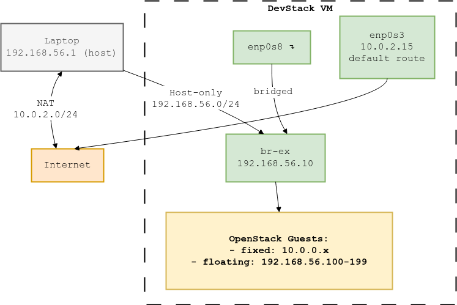

# DevStack Networking ― Quick‑Start Guide

These notes walk students through wiring a DevStack VM in **VirtualBox** so that

* the host (your laptop),
* the DevStack VM, **and**
* every OpenStack guest VM

all have Internet access **and** you can reach guests via floating‑IPs.

---
## 0  Prerequisites
| Item | Example | Notes |
|------|---------|-------|
| Host OS | Windows / macOS / Linux | Any OS that runs VirtualBox ≥ 7.0 |
| DevStack VM | Ubuntu 22.04 LTS (server) | 2 vCPU / 8 GB RAM / 80 GB disk |
| VirtualBox | 2 × NICs | **Adapter 1 = NAT**, **Adapter 2 = Host‑only** |

---
## 1.  VirtualBox network topology



*The Host‑only link is visible only to your laptop & the DevStack VM, keeping
things simple and secure.*

---
## 2.  Prepare the Host‑only network (do once)
1. _VirtualBox ▶ **File ▸ Preferences ▸ Network**_
2. Add **vboxnet0**:
   * IPv4 = `192.168.56.0/24`
   * **Disable** the DHCP server (DevStack will be DHCP later).

---
## 3.  Configure the VM NICs
| Adapter | Setting | Details |
|---------|---------|---------|
| **1** | NAT | leave defaults (gives Internet) |
| **2** | Host‑only Adapter → *vboxnet0* | carries floating‑IPs |

---
## 4.  Static IP inside the VM (Netplan)
Edit `/etc/netplan/10-enp0s8-static.yaml`:
```yaml
network:
  version: 2
  renderer: networkd
  ethernets:
    enp0s8:
      dhcp4: false
      addresses: [192.168.56.10/24]
      nameservers:
        addresses: [8.8.8.8,8.8.4.4]
```

Then apply the changes:
```bash
sudo netplan apply
```
---
## 5.  `local.conf` for DevStack

```bash
[[local|localrc]]
HOST_IP=192.168.56.10
PUBLIC_INTERFACE=enp0s8
FLOATING_RANGE=192.168.56.0/24
Q_FLOATING_ALLOCATION_POOL=start=192.168.56.100,end=192.168.56.199
PUBLIC_NETWORK_GATEWAY=192.168.56.1
OVS_BRIDGE_MAPPINGS=public:br-ex
PUBLIC_BRIDGE=br-ex
Q_USE_PROVIDERNET_FOR_PUBLIC=True
ADMIN_PASSWORD=stack
DATABASE_PASSWORD=$ADMIN_PASSWORD
RABBIT_PASSWORD=$ADMIN_PASSWORD
SERVICE_PASSWORD=$ADMIN_PASSWORD
```

## 6. Run DevStack
```bash
cd /opt/stack/devstack
./stack.sh
```


## 7. Post‑install checks

```bash
# IP sits on br-ex
ip a show br-ex | grep 192.168.56.10

# Neutron API alive
curl -s http://127.0.0.1:9696/ | head

# Horizon redirect
curl -I http://192.168.56.10/ | grep Location   # /auth/login/
```

## 8. Common pitfalls & fixes

| Symptom                         | Cause                        | Fix                                                                                 |
| ------------------------------- | ---------------------------- | ----------------------------------------------------------------------------------- |
| **SSH drop during stack**       | IP moved from enp0s8 → br‑ex | Use console                                   |
| 404 at `/dashboard`             | `horizon.conf` not enabled   | `sudo a2ensite horizon.conf && sudo systemctl restart apache2`                      |
| Connection refused to port 9696 | `neutron-server` dead        | `./rejoin-stack.sh` or `sudo systemctl restart devstack@q-svc`                      |


## 9.  Workflow

1. Boot VM & log in (stack/stack).

2. `cd ~/devstack && ./rejoin-stack.sh` – ensures all services are running.

3. Browse to http://192.168.56.10/ → login (`admin / stack`).

4. Create private network, router to public.

5. Launch instance, allocate floating‑IP (192.168.56.100+).

6. From laptop: `ssh ubuntu@<floating‑IP>`


## 10. After a reboot — what to expect & how to restore

DevStack does not rebuild the bridge on boot. Here are the approach you can have.

### Netplan bridge that survives reboots
Apply it once with sudo netplan apply. From then on `br‑ex` is up (with the IP) before DevStack starts, so SSH to `192.168.56.10` works immediately after every reboot.


```yaml
network:
  version: 2
  renderer: networkd
  ethernets:
    enp0s8: {}
  bridges:
    br-ex:
      interfaces: [enp0s8]
      addresses: [192.168.56.10/24]
      parameters:
        stp: false
```
