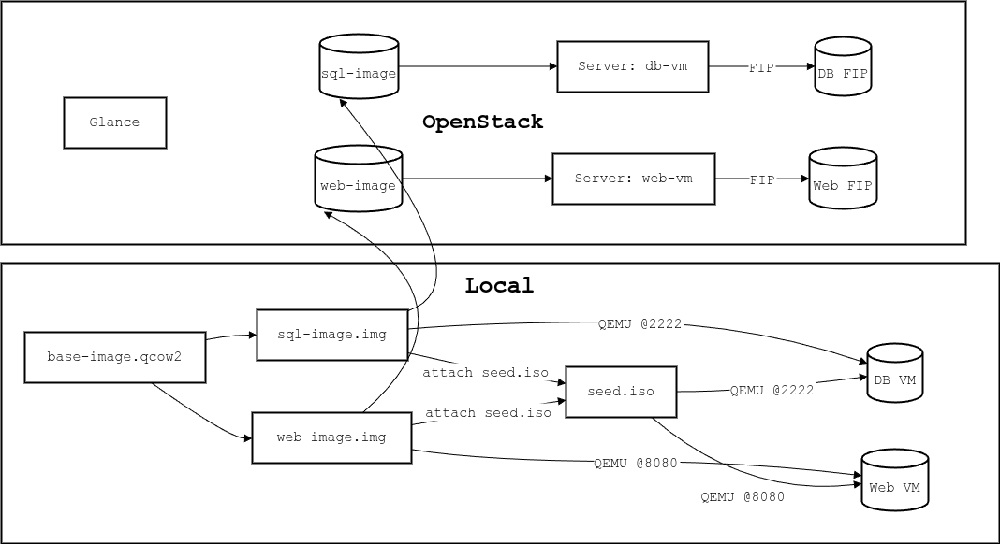

# Local Testing & OpenStack Deployment of DB + Web VM Images

This guide walks you through:

1. **Locally testing** your Cloud-Init–configured DB & Web VM images with QEMU  
2. **Uploading** those images to OpenStack Glance  
3. **Launching** and validating your instances on DevStack (or any OpenStack cloud)

---

## Table of Contents

1. [Prerequisites](#prerequisites)  
2. [Part 0: Download & Prepare Base Images](#part-0-download--prepare-base-images)  
3. [Part I: Local QEMU Testing](#part-i-local-qemu-testing)  
   1. [1. Install Dependencies](#1-install-dependencies)  
   2. [2. Prepare `user-data.yml` & build `seed.iso`](#2-prepare-user-datayml--build-seediso)  
   3. [3. Launch & test the **DB** image](#3-launch--test-the-db-image)  
   4. [4. Launch & test the **Web** image](#4-launch--test-the-web-image)  
   5. [5. SSH / HTTP into your VMs](#5-ssh--http-into-your-vms)  
   6. [6. Mermaid Overview Diagram](#6-mermaid-overview-diagram)  
4. [Part II: Upload & Launch on OpenStack](#part-ii-upload--launch-on-openstack)  
   1. [1. Upload to Glance](#1-upload-to-glance)  
   2. [2. Launch Instances](#2-launch-instances)  
   3. [3. Assign Floating IPs & Test](#3-assign-floating-ips--test)  

---

## Prerequisites

- **Host** with QEMU & KVM (or use `-machine accel=tcg` if `/dev/kvm` is busy)  
- **cloud-image-utils** (for `cloud-localds`)  
- **libguestfs-tools** (for `virt-customize`)  
- **OpenStack** cloud & `openstack` CLI  
- **SSH** keypair on host (`~/.ssh/id_rsa` + `id_rsa.pub`)

---

## Part 0: Download & Prepare Base Images

1. **Download official Ubuntu Jammy Cloud Image**  
   ```bash
   wget https://cloud-images.ubuntu.com/jammy/20250429/jammy-server-cloudimg-amd64.img \
     -O base-image.qcow2
    ```
2. Convert (if needed) & duplicate for DB/Web
```bash
# Ensure QCOW2 format
qemu-img convert -f qcow2 -O qcow2 base-image.qcow2 base-image.qcow2
```
```bash
#Create two working images
cp base-image.qcow2 sql-image.img
cp base-image.qcow2 web-image.img
```

## Part I: Local QEMU Testing
### 1. Install Dependencies

```bash
sudo apt-get update
sudo apt-get install -y cloud-image-utils libguestfs-tools qemu-system-x86
```

### 2. Prepare `user-data.yml` & `build seed.iso`

```bash
# user-data.yml
#cloud-config
users:
  - name: app
    ssh-authorized-keys:
      - ssh-rsa AAAA…your_public_key… app@host
    sudo: ['ALL=(ALL) NOPASSWD:ALL']
    shell: /bin/bash

package_update: true
package_upgrade: true
```
Generate the NoCloud seed disk:
```bash
cloud-localds seed.iso user-data.yml
```
### 3. Launch & test the DB image

1. Bake in DB setup (optional):
```bash
virt-customize -a sql-image.img --firstboot-command '
  apt-get update &&
  apt-get install -y postgresql-14 postgresql-client-14 &&
  sed -i "s/#listen_addresses = .*/listen_addresses = '\''*'\''/" \
    /etc/postgresql/14/main/postgresql.conf &&
  systemctl enable postgresql
'
```
2. Launch the DB VM:
```bash
qemu-system-x86_64 \
  -enable-kvm -m 2048 \
  -drive file=sql-image.img,if=virtio,format=qcow2 \
  -drive file=seed.iso,if=virtio,format=raw \
  -netdev user,id=net0,hostfwd=tcp::2222-:22 \
  -device virtio-net,netdev=net0 \
  -nographic
```
### 4. Launch & test the Web image
1. Bake in Web setup (optional):

```bash
virt-customize -a web-image.img --firstboot-command '
  apt-get update &&
  apt-get install -y nginx python3 python3-pip &&
  pip3 install flask &&
  mkdir -p /opt/app &&
  cat > /opt/app/app.py <<EOF
from flask import Flask
app = Flask(__name__)
@app.route("/")
def hello(): return "Hello from Web VM"
if __name__=="__main__": app.run(host="0.0.0.0", port=80)
EOF &&
  cat > /etc/systemd/system/app.service <<EOF
[Unit]
Description=Flask App
After=network.target
[Service]
ExecStart=/usr/bin/python3 /opt/app/app.py
Restart=always
[Install]
WantedBy=multi-user.target
EOF &&
  systemctl daemon-reload &&
  systemctl enable app.service nginx
'
```
2. Launch the Web VM:
```bash
qemu-system-x86_64 \
  -enable-kvm -m 1024 \
  -drive file=web-image.img,if=virtio,format=qcow2 \
  -drive file=seed.iso,if=virtio,format=raw \
  -netdev user,id=net1,hostfwd=tcp::8080-:80 \
  -device virtio-net,netdev=net1 \
  -nographic
```

### 5. SSH / HTTP into your VMs
```bash
ssh -i ~/.ssh/id_rsa app@127.0.0.1 -p 2222
```

```bash
curl http://127.0.0.1:8080/
```

---
Overview Diagram:



## Part II: Upload & Launch on OpenStack

### 1. Upload to Glance
```bash
openstack image create --disk-format qcow2 --container-format bare --public db-image.img
openstack image create --disk-format qcow2 --container-format bare --public web-image.img
```

### 2. Launch Instances
```bash
openstack server create --flavor m1.small \
  --image sql-image --network app_net db-vm

openstack server create --flavor m1.small \
  --image web-image --network app_net web-vm
```
### 3. Assign Floating IPs & Test
```bash
FIP_DB=$(openstack floating ip create public -f value -c floating_ip_address)
openstack server add floating ip db-vm $FIP_DB
ssh -i ~/.ssh/id_rsa app@$FIP_DB

FIP_WEB=$(openstack floating ip create public -f value -c floating_ip_address)
openstack server add floating ip web-vm $FIP_WEB
curl http://$FIP_WEB/
